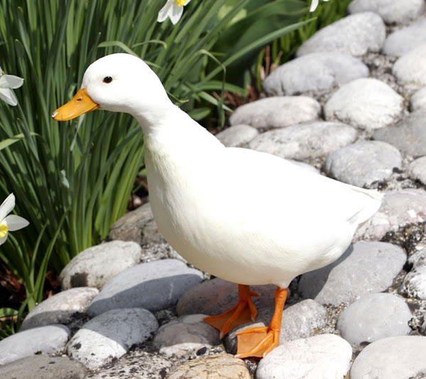

# 517-kinsey-callducks

 practice for ENG 517

## Call Ducks

### What They Are
Call Ducks are ducks that have been breed specifically to be smaller than the average duck. Despite being smaller, they are no less cute! Call Ducks were originally used as decoys for wild ducks for duck hunters. Read about it [here][call duck history]. Despite being smaller, Call Ducks are still used to produce eggs and make great pets! Purchase some [here][purchase call ducks].
### Why I Want Some As Pets
I would love to keep Call Ducks as pets ones day! Some reasons I think they'd be good pets for me are:
* They look super cute.
* I really want to have my own eggs at home so I don't always have to buy them, and I can give them to friends and neighbors.
* They come in different varieties, so I can mix and match their colors!
* I have always wanted ducks.

Some things I have to do before then are:
1. Graduate from grad school with my master's.
1. Get a job, hopefully in the science or environmental communications field using my degree to help bring awareness and action to issues of climate change and environmental justice.
1. Buy a house
1. Get Call Duck supplies and maybe make a faux pond in the backyard for them.
1. Get Call Ducks from a reputable seller, preferably local.

[call duck history]: https://www.raising-ducks.com/call-duck/
[purchase call ducks]: https://www.metzerfarms.com/assorted-call-ducks.html